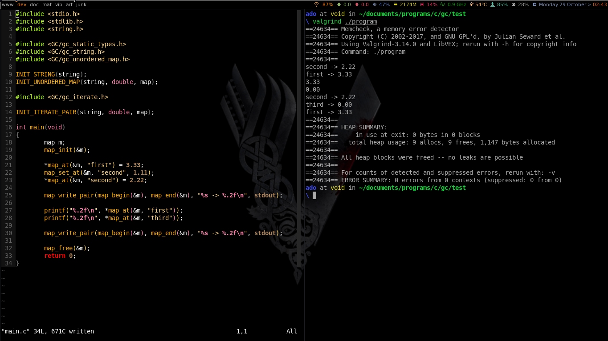

# gc_containers
Generic containers for **C** using macros 

## Usage 
The containers used are similar to the **C++ STL** containers with little 
difference.

First add the **gc_container.h** file into your program.

Since there are no generic functions in C, we manually have to 
init the container using the **INIT_CONTAINER(type, name)** macro.
The **name** has to be a single word, use typedef.
The macro will generate the structures and functions of the
container you wanted, adding **name_** at the begining of 
every structure and function to separate them because function
overload does not exist in C.

When using a container we also have to initialize it manually since
there are no default values in C. Use the function
 __void name_init(struct name_container*)__.

The container destruction has to be done manualy too using the
__void name_free(struct name_container*)__ function.

Those containers can be compiled separately.

More comming soon.

## Examples
### MAP

Format: 
